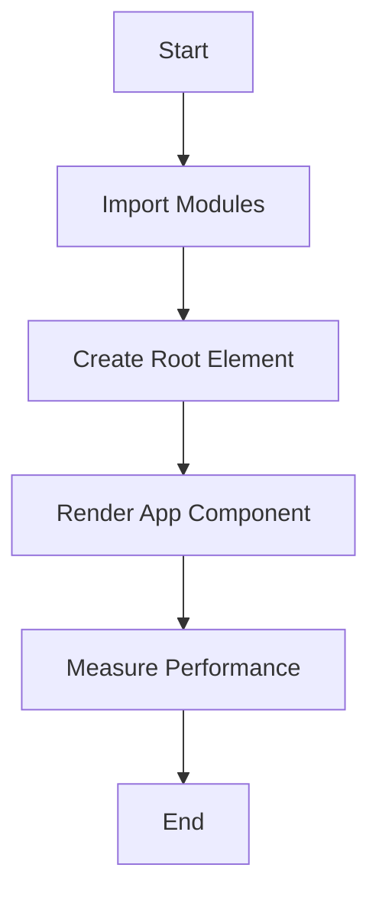

# Documentation for the JavaScript Code

## Description
This code is the entry point for a React application. It imports necessary modules, sets up the root DOM element for rendering the application, and enables performance measurement through the `reportWebVitals` function.

## Code Breakdown

### Imports
- **React**: The core library for building user interfaces.
- **ReactDOM**: Provides methods to interact with the DOM.
- **index.css**: A CSS file for styling the application.
- **App**: The main application component.
- **reportWebVitals**: A utility for measuring performance metrics.

### Root Element Creation
```javascript
const root = ReactDOM.createRoot(document.getElementById('root'));
```
- **Parameter**: 
  - `document.getElementById('root')`: The DOM element where the React application will be rendered.
- **Return Value**: A root object that allows rendering of the React component tree.

### Rendering the Application
```javascript
root.render(
  <React.StrictMode>
    <App />
  </React.StrictMode>
);
```
- **Parameters**: 
  - `<React.StrictMode>`: A wrapper that activates additional checks and warnings for its descendants.
  - `<App />`: The main application component to be rendered.
- **Return Value**: None (void). This method renders the specified React component into the DOM.

### Performance Measurement
```javascript
reportWebVitals();
```
- **Parameters**: 
  - Optional function to log results (e.g., `console.log`).
- **Return Value**: None (void). This function measures and reports performance metrics.

## Usage Example
To use this code, ensure you have a `div` with the id `root` in your HTML file. The following is an example of how to set up the HTML:

```html
<!DOCTYPE html>
<html lang="en">
<head>
    <meta charset="UTF-8">
    <meta name="viewport" content="width=device-width, initial-scale=1.0">
    <title>My React App</title>
</head>
<body>
    <div id="root"></div>
    <script src="path/to/your/bundled/javascript.js"></script>
</body>
</html>
```

## Important Notes
- Ensure that the `root` element exists in your HTML file; otherwise, the application will not render.
- Using `React.StrictMode` is recommended during development to help identify potential problems in the application.
- The `reportWebVitals` function can be customized to send performance data to an analytics endpoint for monitoring application performance.

## Mermaid Diagram


This documentation provides a clear understanding of the code's functionality, usage, and important considerations for developers.