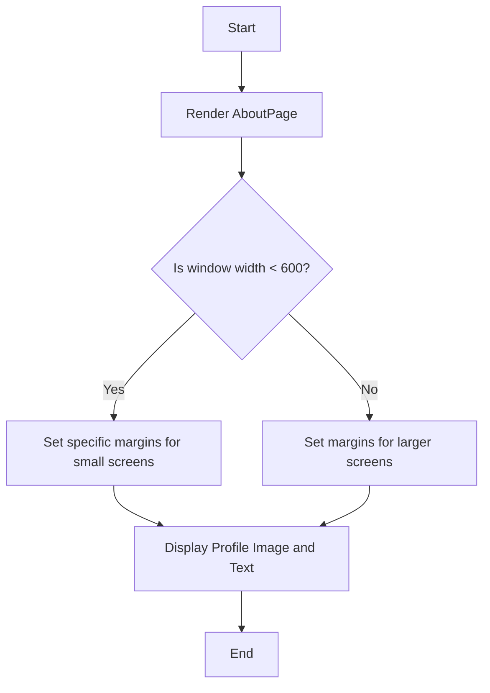

# AboutPage Component Documentation

## Description
The `AboutPage` component is a React functional component that displays a personal introduction. It features a profile image and a brief description of the individual, styled with a responsive layout and a gradient background. The component is designed to be visually appealing and informative, suitable for personal or portfolio websites.

## Functions/Methods

### AboutPage
This is the main functional component that renders the About page.

#### Parameters
- **None**

#### Return Value
- Returns a JSX element representing the About page layout, including text and an image.

#### Usage Example
```javascript
import AboutPage from './path/to/AboutPage';

function App() {
  return (
    <div>
      <AboutPage />
    </div>
  );
}
```

## Important Notes
- The component uses inline styles for layout and responsiveness, which may not be optimal for larger applications. Consider using CSS modules or styled-components for better maintainability.
- The profile image is imported from a local asset directory. Ensure the path is correct to avoid broken image links.
- The component is responsive, adjusting margins based on the window width, which may affect layout on different devices.

## Flowchart


This documentation provides a concise yet thorough understanding of the `AboutPage` component, enabling developers to integrate and utilize it effectively in their projects.