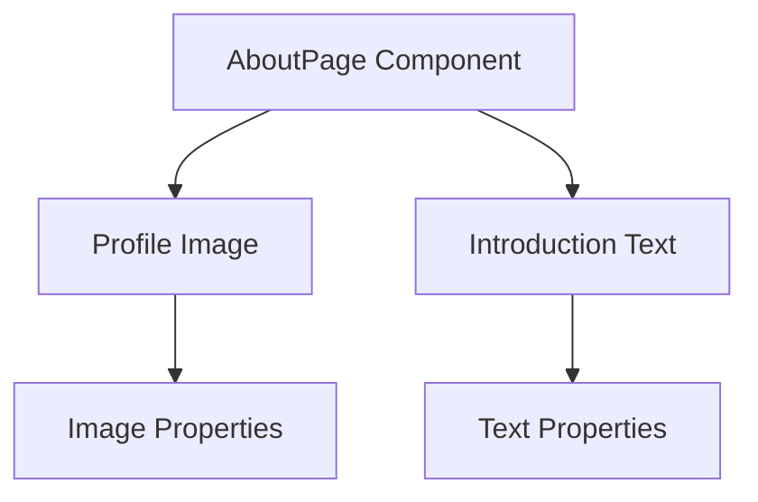

# AboutPage Component Documentation

## Description
The `AboutPage` component is a React functional component that renders an "About Me" section for a personal website. It displays a profile image alongside a brief introduction about the individual, including their background, interests, and aspirations. The layout is responsive, adapting to different screen sizes using CSS Flexbox and inline styles.

## Function: AboutPage

### Parameters
The `AboutPage` component does not accept any parameters.

### Return Value
The component returns a JSX element representing the layout of the About page, including text and an image.

### Detailed Usage Example
To use the `AboutPage` component, import it into your main application file or another component and include it in the JSX:

```javascript
import React from 'react';
import AboutPage from './path/to/AboutPage';

function App() {
  return (
    <div>
      <AboutPage />
    </div>
  );
}

export default App;
```

## Important Notes
- Ensure that the `profileImage` path is correct and the image file exists in the specified directory.
- The component uses inline styles for layout and responsiveness, which may affect maintainability. Consider using CSS classes or styled-components for larger projects.
- The component is designed to be responsive, but testing on various screen sizes is recommended to ensure proper display.

## Mermaid Diagram


This diagram illustrates the structure of the `AboutPage` component, highlighting its main elements: the profile image and the introduction text.