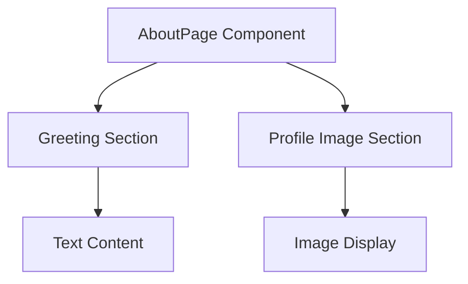

# Documentation for AboutPage Component

## Description

The `AboutPage` component is a React functional component that displays a personal introduction. It features a responsive layout with a profile image and a text section that describes the individual, Jun Liang, including their background, interests, and aspirations. The component utilizes inline styles and CSS classes for layout and design.

## Functions/Methods

### AboutPage

#### Parameters

- **None**: The `AboutPage` component does not accept any parameters.

#### Return Value

- **JSX Element**: Returns a structured layout containing a greeting, a brief introduction, and a profile image.

#### Detailed Usage Example

To use the `AboutPage` component, import it into your main application file and include it in your JSX:

```javascript
import React from "react";
import AboutPage from "./path/to/AboutPage";

function App() {
  return (
    <div>
      <AboutPage />
    </div>
  );
}

export default App;
```

## Important Notes

- The component uses inline styles for layout, which may affect maintainability. Consider using CSS modules or styled-components for better styling practices.
- The profile image is imported from a local assets directory. Ensure the path is correct to avoid broken image links.
- The component is responsive, adjusting margins based on the window width, which may require testing on various devices for optimal appearance.

## Mermaid Diagram



This diagram illustrates the structure of the `AboutPage` component, highlighting its main sections: the greeting and the profile image.
