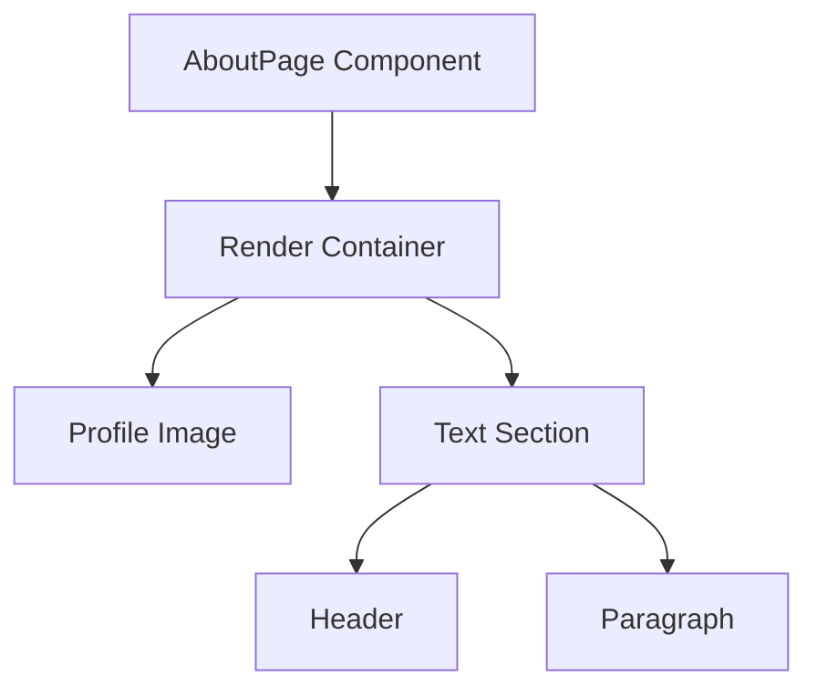

# AboutPage Component Documentation

## Description
The `AboutPage` component is a React functional component that renders a personal introduction section. It displays a profile image alongside a brief description of the individual, Jun Liang, who is a Computer Science student. The layout is responsive, adapting to different screen sizes, and features a visually appealing background gradient.

## Functions/Methods

### AboutPage
This is the main functional component that renders the About page.

#### Parameters
- **None**

#### Return Value
- Returns a JSX element representing the About page layout.

#### Usage Example
```javascript
import AboutPage from './path/to/AboutPage';

// In your main application component
function App() {
  return (
    <div>
      <AboutPage />
    </div>
  );
}
```

## Important Notes
- The component uses inline styles for layout and responsiveness, which may not be ideal for larger applications. Consider using CSS modules or styled-components for better maintainability.
- The profile image is imported from a local assets directory. Ensure the path is correct to avoid broken image links.
- The component relies on the `window.innerWidth` property for responsive design adjustments. This may not update on window resize unless handled explicitly.

## Mermaid Diagram


This diagram illustrates the structure of the `AboutPage` component, showing how it renders the profile image and text section.