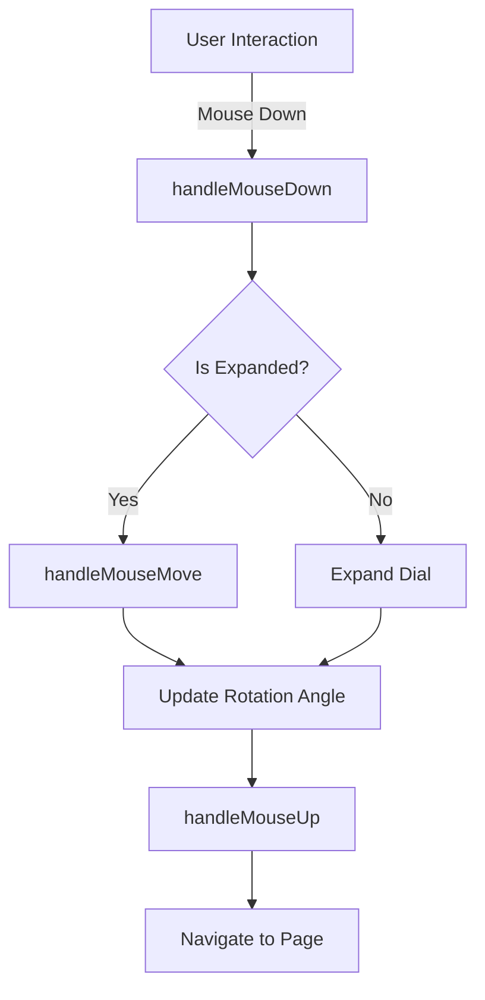

# Documentation for Rotating Navigation Component

## Overview
The provided JavaScript code implements a React application with a rotating navigation component. This component allows users to navigate between different sections of the application by rotating a dial. The navigation is visually enhanced using the `framer-motion` library for animations.

## Components

### 1. RotatingNavigation
This component handles the rotating navigation dial and manages the navigation logic based on user interactions.

#### 1.1 Parameters
- **None** (This component does not accept any props).

#### 1.2 Return Value
- Returns a JSX element representing the rotating navigation dial and its associated UI.

#### 1.3 Usage Example
```jsx
import RotatingNavigation from './RotatingNavigation';

function App() {
  return (
    <div>
      <RotatingNavigation />
    </div>
  );
}
```

### 2. App
The main application component that sets up routing and includes the `RotatingNavigation`.

#### 2.1 Parameters
- **None** (This component does not accept any props).

#### 2.2 Return Value
- Returns a JSX element that includes the navigation and routes for the application.

#### 2.3 Usage Example
```jsx
import App from './App';

ReactDOM.render(<App />, document.getElementById('root'));
```

## Important Functions in RotatingNavigation

### handleMouseDown
- **Parameters**: 
  - `event`: MouseEvent - The mouse down event.
- **Return Value**: 
  - None.
- **Description**: Initiates dragging when the mouse is pressed down on the dial.

### handleMouseMove
- **Parameters**: 
  - `event`: MouseEvent - The mouse move event.
- **Return Value**: 
  - None.
- **Description**: Updates the rotation angle of the dial based on mouse movement.

### handleMouseUp
- **Parameters**: 
  - None.
- **Return Value**: 
  - None.
- **Description**: Finalizes the dragging action and navigates to the selected page based on the dial's angle.

### handleClick
- **Parameters**: 
  - None.
- **Return Value**: 
  - None.
- **Description**: Expands the dial on the first click and navigates to the selected page on the second click.

## Important Notes
- The component uses `useEffect` to handle side effects, such as updating the rotation angle based on the current route and managing event listeners for mouse actions.
- The navigation is responsive, adjusting the size of the dial based on the viewport.
- The component relies on the `react-router-dom` library for navigation between different pages.

## Warnings
- Ensure that the `framer-motion` and `react-router-dom` libraries are installed in your project.
- Be cautious with the event listeners to avoid memory leaks; they are cleaned up in the `useEffect` cleanup function.

## Flowchart


This documentation provides a comprehensive overview of the Rotating Navigation component, its usage, and important functions, enabling developers to understand and implement it effectively.