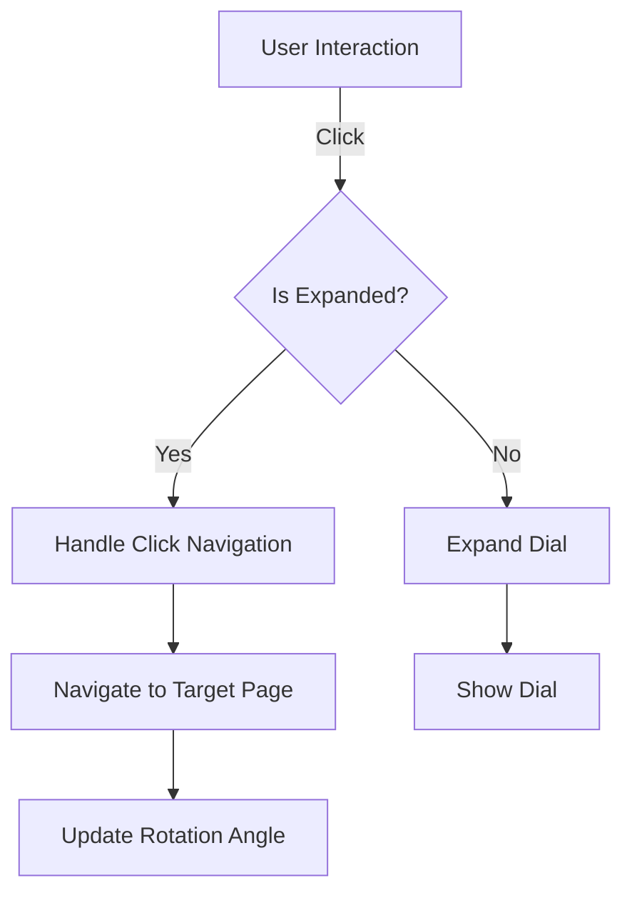

# Documentation for Rotating Navigation Component

## Overview
The provided JavaScript code implements a React application with a rotating navigation component. This component allows users to navigate between different sections of the application by rotating a dial. The dial displays the names of the sections and responds to mouse interactions for both dragging and clicking.

## Components

### 1. `RotatingNavigation`
This component handles the rotating navigation dial and manages the state of the navigation.

#### Parameters
- **None** (This component does not accept any props).

#### Return Value
- Returns a JSX element representing the rotating navigation dial.

#### Usage Example
```jsx
<RotatingNavigation />
```

### Functions within `RotatingNavigation`

#### 1. `useEffect` for Route Change
- **Description**: Updates the rotation angle based on the current route.
- **Parameters**: None.
- **Return Value**: None.
- **Usage Example**: Automatically invoked on route change.

#### 2. `handleMouseDown`
- **Description**: Initiates dragging when the mouse is pressed down on the dial.
- **Parameters**:
  - `event`: Mouse event object.
- **Return Value**: None.
- **Usage Example**: Triggered on `onMouseDown` event of the dial.

#### 3. `handleMouseMove`
- **Description**: Updates the rotation angle based on mouse movement while dragging.
- **Parameters**:
  - `event`: Mouse event object.
- **Return Value**: None.
- **Usage Example**: Triggered on `mousemove` event.

#### 4. `handleMouseUp`
- **Description**: Finalizes the dragging action and navigates to the selected page.
- **Parameters**: None.
- **Return Value**: None.
- **Usage Example**: Triggered on `mouseup` event.

#### 5. `handleClick`
- **Description**: Expands the dial on the first click and navigates to the selected page on the second click.
- **Parameters**: None.
- **Return Value**: None.
- **Usage Example**: Triggered on `onClick` event of the dial.

### 2. `App`
This is the main application component that sets up routing and includes the `RotatingNavigation`.

#### Parameters
- **None** (This component does not accept any props).

#### Return Value
- Returns a JSX element representing the main application layout.

#### Usage Example
```jsx
<App />
```

## Important Notes
- The `RotatingNavigation` component uses `react-router-dom` for navigation, so ensure that the routing is properly set up in your application.
- The component relies on CSS for styling, and the `App.css` file should be included for proper visual representation.
- The component uses `framer-motion` for animations, so ensure that it is installed and imported correctly.

## Flowchart


This documentation provides a comprehensive overview of the `RotatingNavigation` component and its usage within the React application. Developers can refer to this guide to understand the functionality and implementation details.