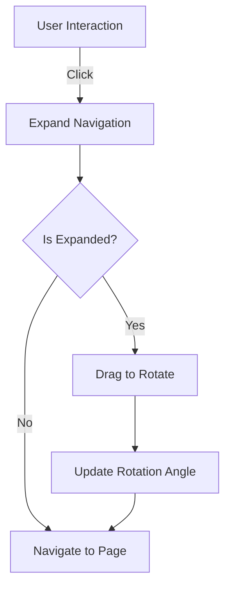

# Documentation for Rotating Navigation Component

## Description
The provided JavaScript code implements a React application with a rotating navigation component. This component allows users to navigate between different pages (About, Journey, Projects, Contact) by dragging or clicking on a circular dial. The application uses React Router for routing and Framer Motion for animations.

## Functions and Methods

### 1. `RotatingNavigation`
This is the main component responsible for rendering the rotating navigation dial.

#### Parameters
- None

#### Return Value
- Returns a JSX element representing the rotating navigation interface.

#### Usage Example
```jsx
<RotatingNavigation />
```

### 2. `useEffect` Hooks
Multiple `useEffect` hooks are used to manage side effects in the component.

#### 2.1 `useEffect` for Route Change
- **Parameters**: None
- **Return Value**: None
- **Description**: Updates the rotation angle based on the current route.

#### 2.2 `useEffect` for Click Outside
- **Parameters**: None
- **Return Value**: None
- **Description**: Collapses the navigation when clicking outside the component.

#### 2.3 `useEffect` for Cleanup
- **Parameters**: None
- **Return Value**: None
- **Description**: Cleans up event listeners on component unmount.

### 3. Event Handlers
#### 3.1 `handleMouseDown`
- **Parameters**: `event` (MouseEvent)
- **Return Value**: None
- **Description**: Initiates dragging when the mouse is pressed down.
  
#### 3.2 `handleMouseMove`
- **Parameters**: `event` (MouseEvent)
- **Return Value**: None
- **Description**: Updates the rotation angle based on mouse movement.

#### 3.3 `handleMouseUp`
- **Parameters**: None
- **Return Value**: None
- **Description**: Finalizes the drag action and navigates to the selected page.

#### 3.4 `handleClick`
- **Parameters**: None
- **Return Value**: None
- **Description**: Expands the navigation on the first click and navigates on the second click.

### 4. `App` Component
This component sets up the routing and renders the `RotatingNavigation`.

#### Parameters
- None

#### Return Value
- Returns a JSX element containing the main application layout and routes.

#### Usage Example
```jsx
<App />
```

## Important Notes
- Ensure that the `react-router-dom` and `framer-motion` libraries are installed in your project.
- The component uses CSS for styling, which should be defined in `App.css`.
- The navigation dial is responsive and adjusts its size based on the viewport.

## Mermaid Flowchart


This documentation provides a comprehensive overview of the Rotating Navigation component, its functions, and usage examples, making it easier for developers to understand and implement the code.