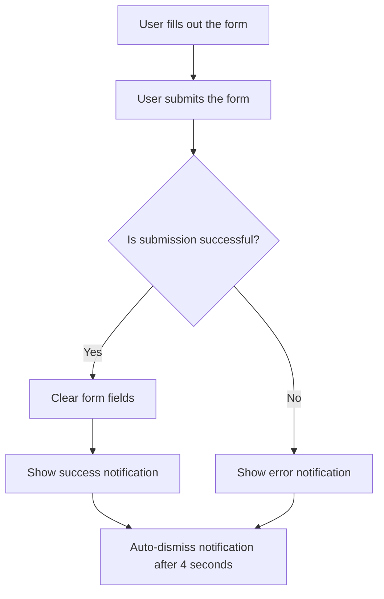

# Documentation for `ContactPage` Component

## Description
The `ContactPage` component is a React functional component that provides a contact form for users to send messages. It captures user input for first name, last name, email, phone number, and a message. Upon submission, it sends the data to a specified API endpoint and displays a notification based on the success or failure of the submission.

## Functions and Methods

### `handleSubmit(e)`
Handles the form submission.

#### Parameters
- `e` (Event): The event object from the form submission.

#### Return Value
- None (void). It updates the component state based on the submission result.

#### Usage Example
```javascript
<form onSubmit={handleSubmit}>
    {/* Form fields */}
</form>
```

### `React.useEffect()`
Automatically dismisses the notification after 4 seconds.

#### Parameters
- None.

#### Return Value
- None (void). It sets up a timer to clear the notification.

#### Usage Example
```javascript
React.useEffect(() => {
    // Effect logic
}, [showNotification, notification]);
```

## Important Notes
- The component uses the `useState` hook to manage form input and notification states.
- The form submission is handled asynchronously, and error handling is implemented to manage failed submissions.
- The notification will automatically disappear after 4 seconds, providing feedback to the user.
- Ensure that the API endpoint `/api/contact` is correctly set up to handle POST requests with the expected payload.

## Mermaid Flowchart


This documentation provides a concise overview of the `ContactPage` component, detailing its functionality, methods, and usage, making it easier for developers to understand and implement.