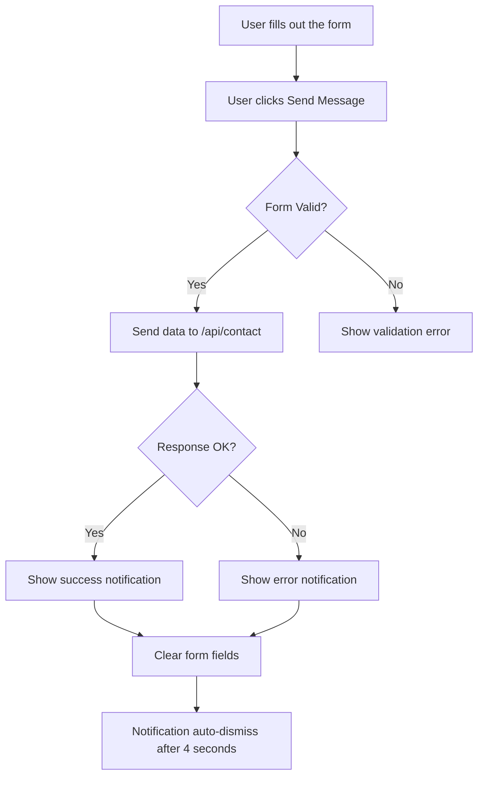

# Documentation for `ContactPage` Component

## Description
The `ContactPage` component is a React functional component that provides a contact form for users to send messages. It includes fields for the user's first name, last name, email, phone number, and a message. Upon submission, the form sends the data to a specified API endpoint and displays a notification based on the success or failure of the submission.

## Functions and Methods

### `handleSubmit(e)`
Handles the form submission.

#### Parameters
- `e` (Event): The event object from the form submission.

#### Return Value
- None (void). It updates the component state based on the submission result.

#### Usage Example
```javascript
<form onSubmit={handleSubmit}>
    {/* Form fields here */}
</form>
```

### `React.useEffect()`
Automatically dismisses the notification after 4 seconds.

#### Parameters
- None.

#### Return Value
- None (void). It sets up a timer to clear the notification.

#### Usage Example
```javascript
React.useEffect(() => {
    // Effect logic here
}, [showNotification, notification]);
```

## Important Notes
- The component uses the `fetch` API to send a POST request to `/api/contact`. Ensure that this endpoint is correctly set up on the server to handle incoming messages.
- The notification will automatically disappear after 4 seconds, but users can also see it until they navigate away from the page.
- The form fields are required, and the submit button is disabled while the message is being sent to prevent multiple submissions.

## Mermaid Flowchart


This documentation provides a clear understanding of the `ContactPage` component, its functionality, and how to use it effectively.