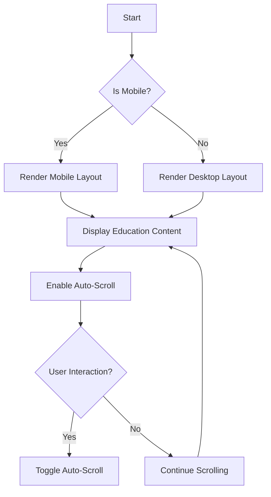

# Documentation for `EducationPage.js`

## Description
The `EducationPage` component is a React functional component that displays educational information in a scrollable format. It adapts its layout based on the window size, providing a responsive design for both mobile and desktop views. The component includes an auto-scroll feature for the educational content, which can be toggled by the user.

## Functions/Methods

### `useWindowSize`
This custom hook tracks the current window size and updates the state whenever the window is resized.

#### Parameters
- None

#### Return Value
- An object containing the current `width` and `height` of the window.

#### Usage Example
```javascript
const { width, height } = useWindowSize();
```

### `EducationPage`
The main component that renders the education information.

#### Parameters
- None

#### Return Value
- Renders a JSX element representing the education page.

#### Usage Example
```javascript
import EducationPage from './EducationPage';
```

## Important Notes
- The component uses the `useNavigate` hook from `react-router-dom` for navigation.
- The auto-scroll feature starts after a 1-second delay and scrolls the content every 20 milliseconds.
- The component handles cleanup of intervals and timeouts to prevent memory leaks.
- The styles are defined inline for simplicity, but it is recommended to use CSS modules or styled-components for larger applications.

## Flowchart


This documentation provides a concise overview of the `EducationPage` component, its functionality, and usage, making it easier for developers to understand and implement.