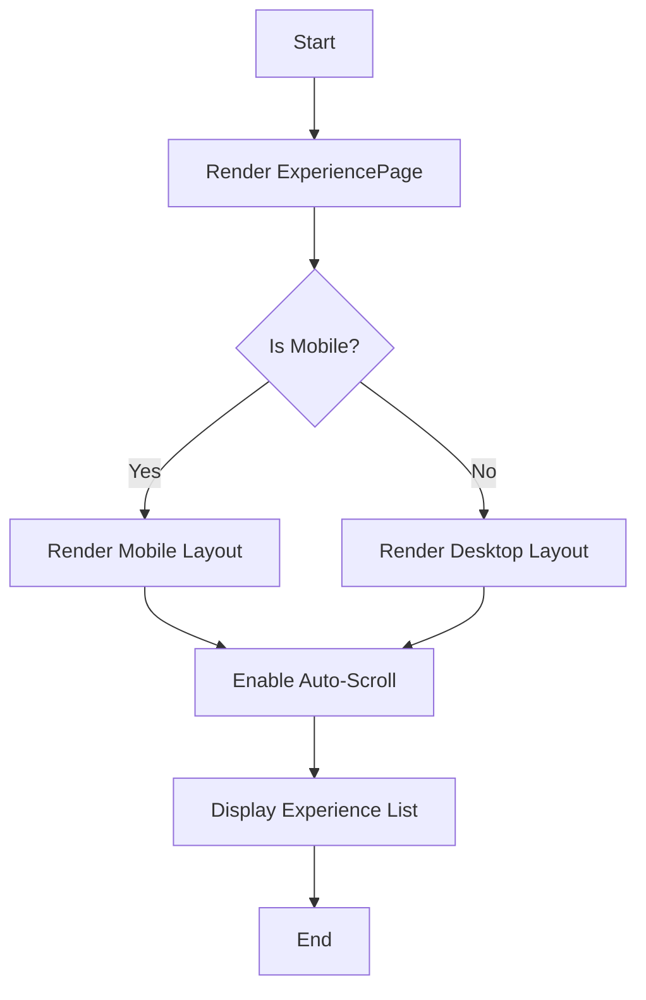

# Documentation for ExperiencePage Component

## Description
The `ExperiencePage` component is a React functional component that displays a list of experiences in a scrollable format. It adjusts its layout based on the window size, providing a responsive design for both mobile and desktop views. The component includes auto-scrolling functionality and a back navigation button.

## Functions and Methods

### `useWindowSize`
This custom hook tracks the current window size.

#### Parameters
- None

#### Return Value
- An object containing the current `width` and `height` of the window.

#### Usage Example
```javascript
const { width, height } = useWindowSize();
console.log(`Width: ${width}, Height: ${height}`);
```

### `ExperiencePage`
The main component that renders the experience list and handles scrolling.

#### Parameters
- None

#### Return Value
- Renders a JSX element containing the experience information.

#### Usage Example
```javascript
import ExperiencePage from './ExperiencePage';

function App() {
    return <ExperiencePage />;
}
```

## Important Notes
- The component uses the `useEffect` hook to manage side effects such as window resizing and auto-scrolling.
- The auto-scrolling feature can be toggled on and off using a button.
- The component is designed to be responsive, with different styles applied based on the window width.

## Mermaid Diagram


## Warnings
- Ensure that the `react-router-dom` package is installed for navigation functionality.
- The component relies on the `Instrument Sans` font; ensure it is available in your project for proper styling.