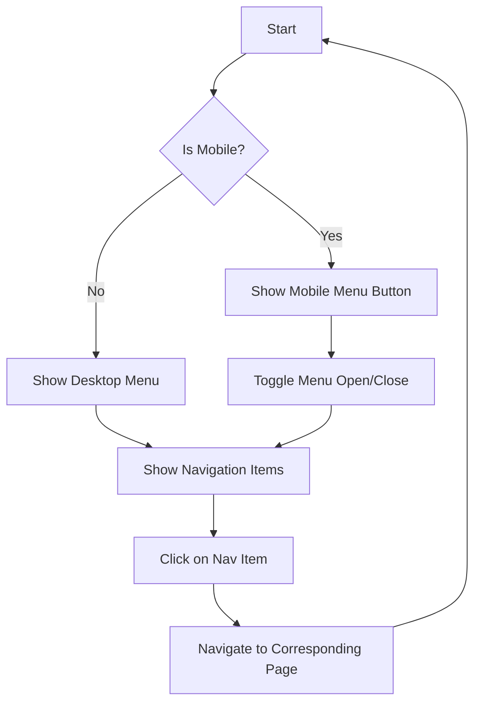

# Navigation Component Documentation

## Description
The `Navigation` component is a responsive navigation bar built using React. It provides links to various sections of a website, including "About Me," "My Journey," "Projects," and "Contact." The navigation adapts to mobile screens by displaying a toggleable menu. It also includes a logo that redirects to the homepage and a button to download a resume.

## Functions and Methods

### 1. `Navigation()`
This is the main functional component that renders the navigation bar.

#### Parameters
- None

#### Return Value
- Returns a JSX element representing the navigation bar.

#### Usage Example
```javascript
import Navigation from './Navigation';

function App() {
    return (
        <div>
            <Navigation />
            {/* Other components */}
        </div>
    );
}
```

## Important Notes
- The component uses the `useNavigate` hook from `react-router-dom` for navigation.
- The `useState` hook is used to manage the state of the mobile menu.
- The component's styles are inline and responsive, adjusting based on the viewport width.
- Ensure that the logo image and resume PDF are correctly linked in the project structure.

## Flowchart


This documentation provides a concise overview of the `Navigation` component, its functionality, and usage, making it easier for developers to understand and implement it in their projects.