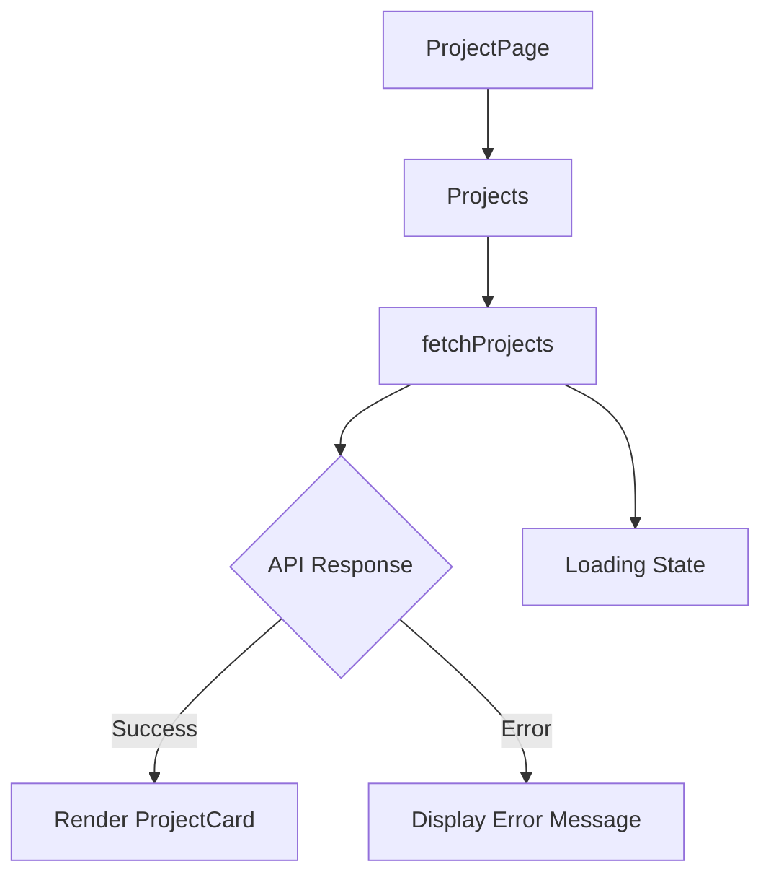

# ProjectPage Component Documentation

## Overview
The `ProjectPage` component is a React functional component that displays a collection of project cards fetched from an API. Each project card contains details such as the project title, description, link, hackathon name, and type. The component also includes a welcoming section and a project showcase section.

## Components

### 1. ProjectCard

#### Description
The `ProjectCard` component renders individual project details in a styled card format.

#### Parameters
- **title**: `string` - The title of the project.
- **description**: `string` - A brief description of the project.
- **link**: `string` - A URL link to more details about the project.
- **hackathonName**: `string` - The name of the hackathon associated with the project.
- **type**: `string` - The type/category of the project.

#### Return Value
- Returns a JSX element representing the project card.

#### Usage Example
```javascript
<ProjectCard 
  title="My Awesome Project" 
  description="This project does amazing things." 
  link="https://example.com" 
  hackathonName="Hackathon 2023" 
  type="Web App" 
/>
```

### 2. Projects

#### Description
The `Projects` component fetches project data from an API and renders a grid of `ProjectCard` components.

#### Parameters
- None

#### Return Value
- Returns a JSX element containing a grid of `ProjectCard` components or loading/error messages.

#### Usage Example
```javascript
<Projects />
```

### 3. ProjectPage

#### Description
The `ProjectPage` component serves as the main entry point, combining the welcome section and the project showcase.

#### Parameters
- None

#### Return Value
- Returns a JSX element representing the entire project page layout.

#### Usage Example
```javascript
<ProjectPage />
```

## Important Notes
- Ensure that the API endpoint `/api/hackathons` is available and returns the expected data structure.
- The component handles loading and error states gracefully, displaying appropriate messages to the user.

## Flowchart


This documentation provides a clear understanding of the `ProjectPage` component and its subcomponents, enabling developers to utilize and modify the code effectively.