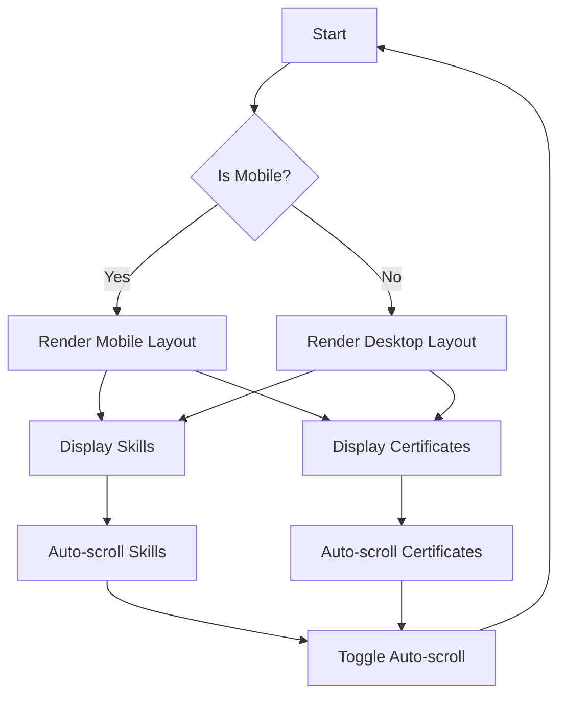

# SkillPage Component Documentation

## Description
The `SkillPage` component is a React functional component that displays a user's skills and certifications. It features auto-scrolling sections for skills and certificates, responsive design for mobile and desktop views, and a back navigation button. The component utilizes hooks for managing state and side effects, including window resizing.

## Functions and Methods

### `useWindowSize`
This custom hook tracks the window size and updates the state when the window is resized.

#### Parameters
- None

#### Return Value
- An object containing the current `width` and `height` of the window.

#### Usage Example
```javascript
const { width, height } = useWindowSize();
```

### `SkillPage`
The main functional component that renders the skills and certificates.

#### Parameters
- None

#### Return Value
- JSX element representing the skill page.

#### Usage Example
```javascript
import SkillPage from './SkillPage';
// In your component render
<SkillPage />
```

## Important Notes
- The component uses `useRef` to reference DOM elements for scrolling.
- The auto-scroll feature can be toggled on and off using a button.
- The component is responsive, adjusting styles based on the window width.
- The `useEffect` hook is used to manage side effects, such as adding and removing event listeners.

## Flowchart


## Warnings
- Ensure that the `skillImage` path is correct to avoid broken images.
- The auto-scroll feature may cause performance issues on very large content; consider optimizing if necessary.