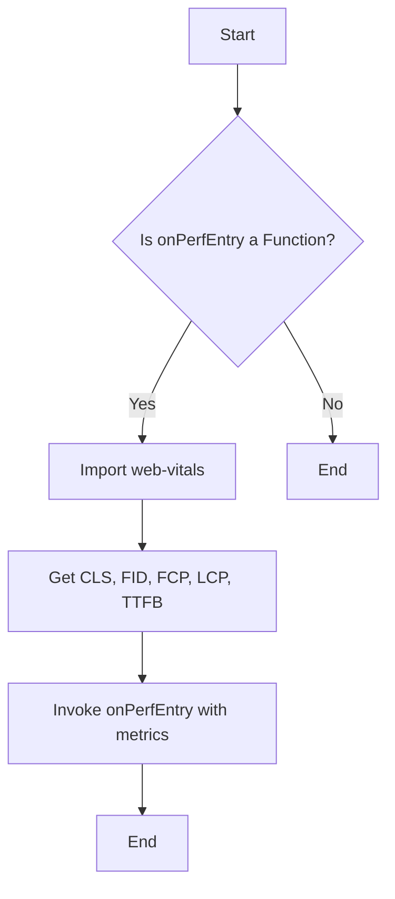

# Documentation for `reportWebVitals.js`

## Description
The `reportWebVitals` function is designed to measure and report web performance metrics using the `web-vitals` library. It accepts a callback function that will be invoked with various performance metrics, allowing developers to track the performance of their web applications.

## Function: `reportWebVitals`

### Parameters
- **onPerfEntry**: 
  - Type: `Function`
  - Description: A callback function that will receive performance metrics as arguments. This function is called for each metric collected by the `web-vitals` library.

### Return Value
- The function does not return a value. It invokes the provided callback function with performance metrics if the callback is valid.

### Detailed Usage Examples
```javascript
import reportWebVitals from './reportWebVitals';

const logPerformanceMetrics = (metric) => {
  console.log(metric);
};

// Call reportWebVitals with the logging function
reportWebVitals(logPerformanceMetrics);
```

In this example, `logPerformanceMetrics` is passed as the `onPerfEntry` callback, which logs each performance metric to the console.

## Important Notes
- Ensure that the `web-vitals` library is installed in your project. You can install it using npm:
  ```bash
  npm install web-vitals
  ```
- The `onPerfEntry` parameter must be a function; otherwise, no metrics will be reported.
- This function is typically called in the entry point of a React application (e.g., `index.js`) to capture performance metrics right after the application loads.

## Mermaid Flowchart


This flowchart illustrates the process of checking the validity of the `onPerfEntry` function, importing the necessary metrics, and invoking the callback with the collected metrics.